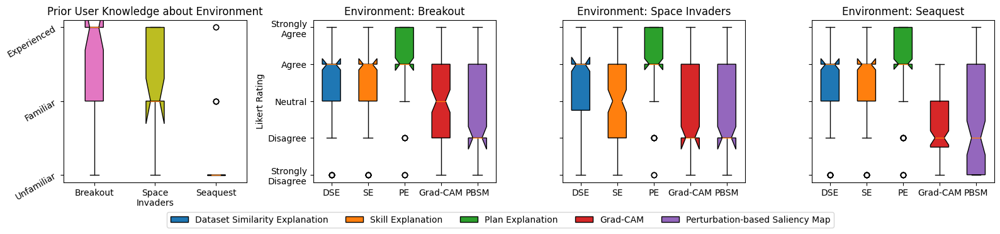
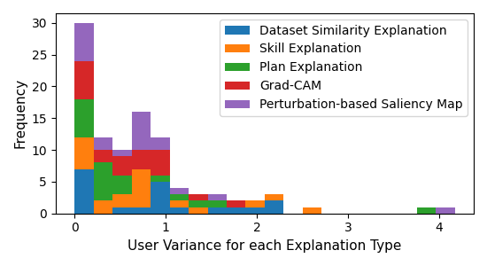
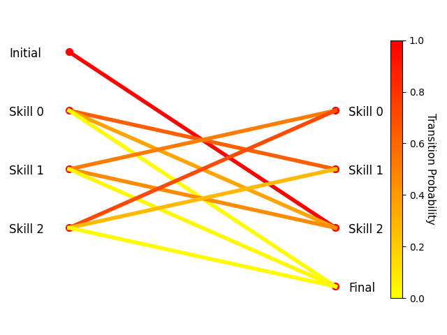

# Temporal Explanations for Explainable Reinforcement Learning

> Despite significant progress in deep reinforcement learning across a range of environments, there are still limited tools to understand why agents make decisions. In particular, we consider how certain actions enable an agent to collect rewards or achieve its goals. Understanding this temporal context for actions is critical to explaining an agent’s choices. To date, however, little research has explored such explanations, and those that do depend on domain knowledge. We address this by developing three novel types of local temporal explanations, two of which do not require domain knowledge, and two novel metrics to evaluate agent skills. We conduct a comprehensive user survey of our explanations against two state-of-the-art local non-temporal explanations for Atari environments and find that our explanations are preferred by users 80.7% of the time over the state-of-the-art explanations.

## Example Explanations

<video>
    <source src="user-survey/observation-explanations/contrastive-0.mp4">
</video>

Example observation for Breakout

    
Dataset Similarity Explanation

    <video>
        <source src="analysis/figs/examples/Breakout/dataset-similarity-explanation.mp4">
    </video>

    
Skill Explanation

    <video>
        <source src="analysis/figs/examples/Breakout/skill-explanation.mp4">
    </video>

    
Plan Explanation

    <video>
        <source src="analysis/figs/examples/Breakout/plan-explanation.mp4">
    </video>

    
Grad-CAM Explanation

    

    
Perturbation-based Saliency Maps

    

## User Survey results

## Discovered Skills evaluation

## Code

Python requirements can be found in [requirement.txt](requirements.txt) and installed with `pip install -r requirements.txt`. Additionally, to use the project might require installing `temporal_explanations_4_xrl` using `pip install -e .` in the root directory, no pypi exists currently.

To understand the project structure, we have outlined the purpose of the most important files.
* `temporal_explanations_4_xrl/explain.py` - Explanation code for all of our novel explanation, code to save the explanations with the relevant observation (both individually and to compare) along with implementations of Grad-CAM and Perturbation-based Saliency Maps.
* `temporal_explanations_4_xrl/skill.py` - Skill instance class and skill alignment and distribution metric implementations
* `temporal_explanations_4_xrl/plan.py` - Plan class with methods for computing several metrics across all skills and each skill individually
* `temporal_explanations_4_xrl/graying_the_black_box.py` - Implementation of Zahavy et al., 2016 "Graying the black box: Understanding DQNs"
* `datasets/annotate-domain-knowledge.py` - A command line based python script to load pre-defined skills for a set of episode and provide text-based explanations of the purpose for each skill.
* `datasets/hand-label-skills.py` - A command line based python script to hand-label skilled for individual episodes, each observation can be provided an individual skill number between 0 and 9
* `datasets/generate_datasets.py` - A python script to generate datasets for a several environments with options for the size, agent types, etc
* `datasets/discover_skills.py` - A python script using pre-generated datasets to discover agent skills using the algorithm proposed by Zahavy et al., 2016
